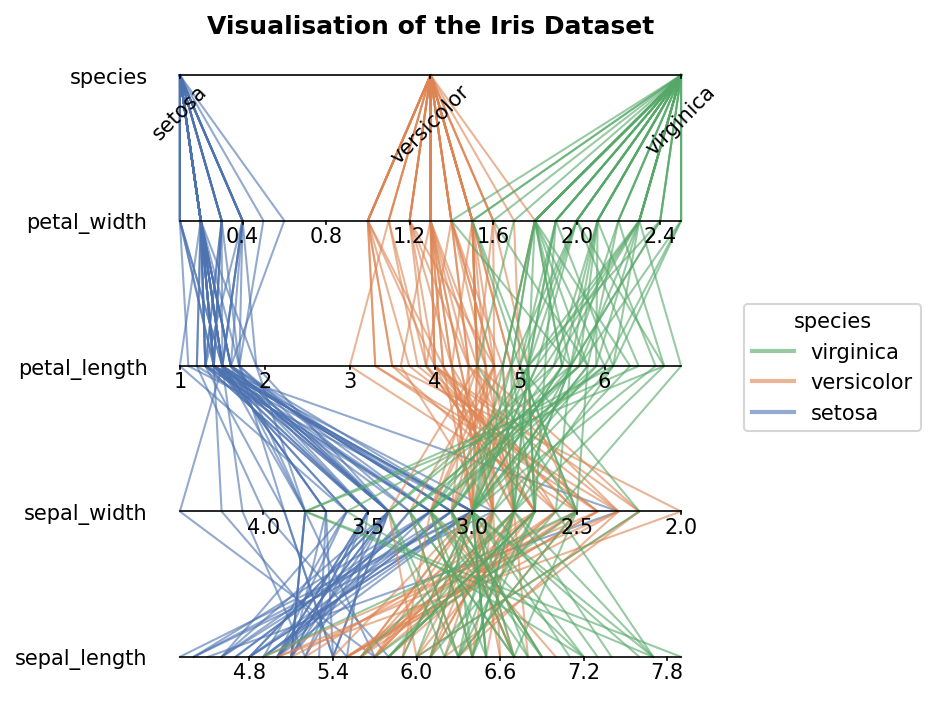

# Seaborn Parallel Coordinates Plot

[](https://github.com/jannikmi/seaborn-paracoords/actions)
[](https://www.python.org/downloads/)
[](https://opensource.org/licenses/MIT)
[](https://github.com/astral-sh/ruff)

A prototype implementation of parallel coordinates plots compatible with Seaborn's API and styling system.



## Motivation

Parallel coordinates plots are a powerful tool for exploring multi-dimensional data, enabling users to visualize patterns and relationships across multiple continuous variables at once.

While Python libraries like `pandas.plotting.parallel_coordinates` and `plotly.express.parallel_coordinates` provide basic functionality, they lack the flexibility, aesthetics, and composability that Seaborn’s API and design philosophy offer. This project aims to fill that gap by providing a prototype implementation that:

- Preserves original data ranges by default, making interpretation more intuitive.
- Supports both vertical and horizontal orientations, allowing for more readable plots when variable names are long.
- Integrates with familiar Seaborn-style color palettes, theming, and grouping via `hue`.
- Lays the groundwork for future composability with grid/facet systems and publication-quality visuals.

### Why Not Just Use Existing Libraries?

Most existing Python implementations are either limited to vertical orientation or require manual workarounds for horizontal layouts. For example:

| Library                                 | Parallel Coordinates Support | Orientation Option         |
|-----------------------------------------|-----------------------------|---------------------------|
| pandas.plotting.parallel_coordinates    | ✅ basic static plot         | ❌ no orientation param    |
| plotly.express.parallel_coordinates     | ✅ rich, interactive         | ❌ no horizontal layout    |
| HiPlot (Facebook)                       | ✅ interactive explorer      | ❌ fixed orientation       |
| Altair / Vega-Lite                      | ⚠️ can mimic via layering   | ❌ no built-in PC plot     |
| bokeh / holoviews                       | ⚠️ possible via custom glyphs| ❌ not directly supported  |
| parcoords (PyPI)                        | ✅ dedicated package         | ❌ no horizontal layout    |
| matplotlib                              | ⚙️ possible manually         | ✅ but only via custom code|

Transposing data is not a valid substitute for orientation control, as it changes the meaning of the plot. This project provides a true visual rotation, not just a semantic one.

### Example Use Case

If you have a dataset with many variables and long, descriptive names, a horizontal parallel coordinates plot can make axis and tick labels much more readable. This enables visual comparison across many samples—something not currently achievable with existing libraries without custom Matplotlib code.

### Design Philosophy

This prototype is inspired by Seaborn’s high-level, declarative approach:

- A single function call creates a clear, publication-quality plot.
- Orientation, color, and style are easily controlled with intuitive parameters.
- The API is designed to be familiar to Seaborn users, but is implemented outside the Seaborn library for rapid prototyping and experimentation.


## Features

- 🎨 **Seaborn Integration** - Works seamlessly with Seaborn's color palettes and styling
- 📊 **Flexible Orientations** - Supports both vertical and horizontal plot layouts
- 🎯 **Original Axis Values** - Displays actual data ranges by default (not normalized 0-1)
- 🔗 **Shared Axis Scaling** - Optional `sharex`/`sharey` parameters for unified scales
- 🌈 **Color Encoding** - Built-in support for categorical color mapping via `hue` parameter
- 📋 **Categorical Axes** - Full support for categorical variables with automatic detection
- ⚙️ **Customizable** - Full control over line transparency, width, and matplotlib styling

## Overview

This project provides a `parallelplot()` function that creates parallel coordinates visualizations with a Seaborn-like interface. Parallel coordinates plots are useful for visualizing multivariate data by representing each data point as a line that connects values across multiple axes.

## Installation

```bash
# Clone the repository
gh repo clone jannikmi/seaborn-paracoords
cd seaborn-paracoords

# Install dependencies using uv (recommended)
uv sync --all-groups

# Or install manually
pip install -e .
```


## Usage

### Basic Example

```python
import pandas as pd
import seaborn_parallel as snp

# Numeric data
df = pd.DataFrame({
    "var1": [1, 2, 3, 4],
    "var2": [5, 6, 7, 8],
    "var3": [9, 10, 11, 12]
})

ax = snp.parallelplot(df, orientation="horizontal")
```

### Categorical Axes

```python
# Mixed-type data with categorical variables
df = pd.DataFrame({
    "species": ["setosa", "versicolor", "virginica", "setosa"],
    "sepal_length": [5.1, 7.0, 6.3, 4.9],
    "petal_width": [0.2, 1.3, 2.5, 0.2]
})

# Categorical columns are automatically detected!
ax = snp.parallelplot(df, hue="species")

# Or specify explicitly with custom ordering
ax = snp.parallelplot(
    df,
    categorical_axes=["species"],
    category_orders={"species": ["setosa", "versicolor", "virginica"]}
)
```

See the [example scripts](scripts/) for demonstration of various features:

```bash
# Run the main module example
uv run python src/seaborn_parallel/parallelplot.py

# Run demo scripts
uv run python scripts/demo_iris_vertical.py
uv run python scripts/demo_comparison.py
uv run python scripts/demo_categorical_axes.py  # New!

# Run all demos
uv run python scripts/run_all_demos.py
```


## API Documentation

The `parallelplot()` function provides a flexible interface for creating parallel coordinates visualizations.

**For complete API documentation**, including all parameters and their descriptions, see the docstring in [`src/seaborn_parallel/parallelplot.py`](src/seaborn_parallel/parallelplot.py).

**Key Parameters:**

- `data`: Input DataFrame
- `vars`: Variables to plot (defaults to all columns including categorical)
- `hue`: Variable for color encoding
- `orientation`: "vertical" or "horizontal"
- `sharex`/`sharey`: Share axis ranges across numeric variables
- `categorical_axes`: Explicitly specify categorical variables (auto-detected if None)
- `category_orders`: Custom ordering for categorical variables
- `alpha`, `linewidth`, `palette`: Styling options

## Key Features

### Categorical Axis Support

**Automatically visualize mixed-type datasets** with both numeric and categorical variables:

```python
import seaborn_parallel as snp

df = pd.DataFrame({
    "region": ["North", "South", "East", "West"],
    "product": ["A", "B", "C", "D"],
    "sales": [100, 150, 200, 250],
    "profit": [20, 30, 40, 50]
})

# Categorical columns auto-detected!
ax = snp.parallelplot(df, hue="region")
```

**Features:**
- ✨ Automatic detection of non-numeric columns
- 🎯 Explicit control via `categorical_axes` parameter
- 📊 Custom category ordering with `category_orders`
- 🔄 Works with both orientations
- 🎨 Integrates with `hue` and all styling options

See [`demo_categorical_axes.py`](scripts/demo_categorical_axes.py) for comprehensive examples!

### Default Behavior: Original Axis Values

Unlike many parallel coordinates implementations that normalize all axes to [0,1], this implementation **preserves original data ranges** by default. This makes it easier to interpret actual values and is especially useful when variables have very different scales.

### Optional Shared Scaling

Use `sharex` or `sharey` when you want all variables to share the same scale. For vertical orientation, use `sharey=True`. For horizontal orientation, use `sharex=True`.

See the demo scripts for visual examples of both modes:

- [`demo_comparison.py`](scripts/demo_comparison.py) - Side-by-side comparison
- [`demo_scaling_verification.py`](scripts/demo_scaling_verification.py) - Detailed scaling examples


## Running the Examples

The repository includes several demo scripts:

```bash
# Run a single demo
uv run python scripts/demo_iris_vertical.py

# Run all demos
uv run python scripts/run_all_demos.py

# Run the main module example
uv run python src/seaborn_parallel/parallelplot.py
```

Output images are saved to the `tmp/` directory.


## Testing

```bash
# Run all tests
uv run pytest tests/

# Run with coverage
uv run pytest tests/ --cov=src --cov-report=html

# Run specific test
uv run pytest tests/test_parallelplot.py::test_sharex_parameter -v
```


## Development

This project uses modern Python development tools:

- **Package Manager**: [uv](https://github.com/astral-sh/uv)
- **Testing**: pytest
- **Linting**: ruff, isort
- **Type Checking**: mypy
- **Pre-commit Hooks**: configured in `.pre-commit-config.yaml`

```bash
# Install pre-commit hooks
make hook

# Run linting
make lint

# Sync dependencies
uv sync --all-groups
```


## Known Limitations

- Individual axis tick labels are displayed as text annotations when not using shared axes
- Large datasets may require adjustment of `alpha` and `linewidth` for readability
- ⚠️ **Breaking change in v0.0.2**: When `vars=None`, all columns (including categorical) are selected instead of only numeric columns. To restore old behavior, explicitly pass numeric columns via the `vars` parameter.


## Contributing

See [CONTRIBUTING.md](CONTRIBUTING.md) for detailed guidelines on how to contribute to this project.


## License

See LICENSE file for details.


## Acknowledgments

- Built with [Seaborn](https://seaborn.pydata.org/) for color palettes and styling
- Uses [Matplotlib](https://matplotlib.org/) for underlying plot rendering
